# Bring Your Own Azure AI Foundry Model to AI Prompts

In this lab, you will learn how to deploy and connect your own Azure AI Foundry models to AI Builder prompts in the Power Platform. This allows you to leverage advanced AI models for generating responses in your applications, enhancing the capabilities of AI Builder.

This lab will guide you through the process from scratch, including creating a dedicated Power Platform solution, deploying models in Azure AI Foundry, and connecting those models to AI Builder prompts.

## ⚙️ Prerequisites

- Power Platform environment with access to:
  - AI Builder
- Access to Microsoft Azure / Azure AI Foundry with the same account as the Power Platform environment

## 🚀 Lab Walkthrough

### Create a dedicated Power Platform solution

1. Navigate to [Power Apps](https://make.powerapps.com/) and log in with your credentials.

1. On the left sidebar, select **Solutions**.

    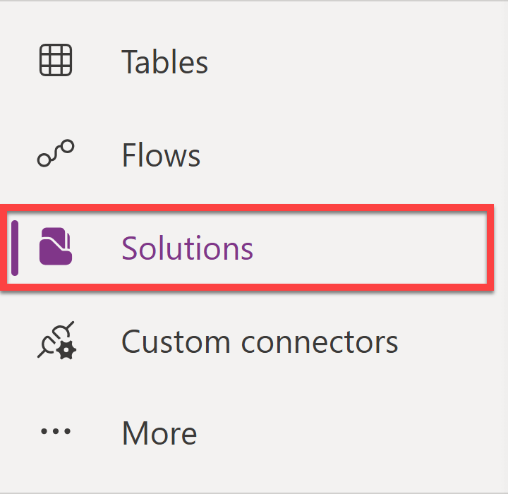

1. Select **+ New solution**.

    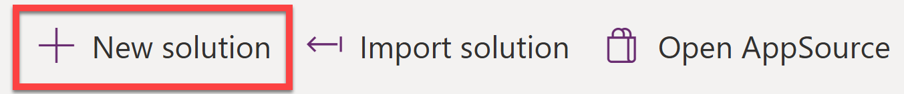

1. On the **New solution** page, enter the following details:
    - **Display name**: `Bring Your Own Model Solution`
    - **Name**: `BringYourOwnModelSolution`
    - **Publisher**: _Select the default publisher or create a new one._
    - **Version**: `1.0.0.0`
    - **Set as your preferred solution**: ✅

        > **Note:**
        > Setting a preferred solution ensures that all your custom components go into a dedicated unmanaged solution instead of the generic system solutions, giving you clear separation, consistent publisher settings, and full control.
        >
        > This makes it easy to export your tailored solution for deployment to other Dataverse environments and keeps collaboration with others clean and predictable.

        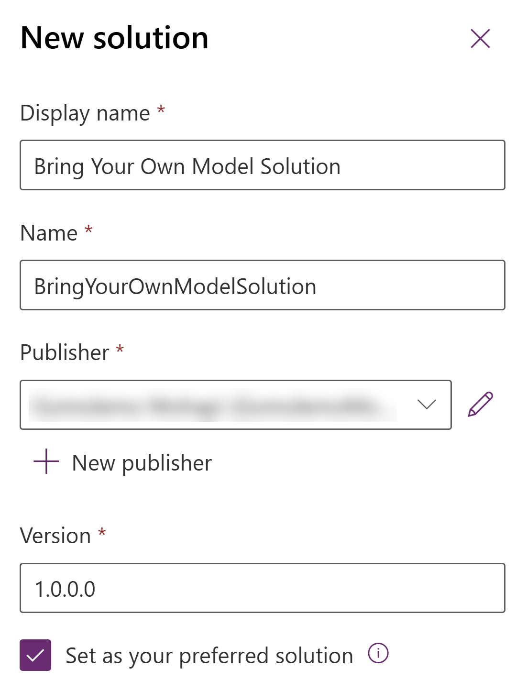

1. Then click **Create**.

    The solution will then be created and you will be redirected to the solution's overview page.

1. While on the solution's overview page, select the **Back to solutions** icon to return to the solutions page.

    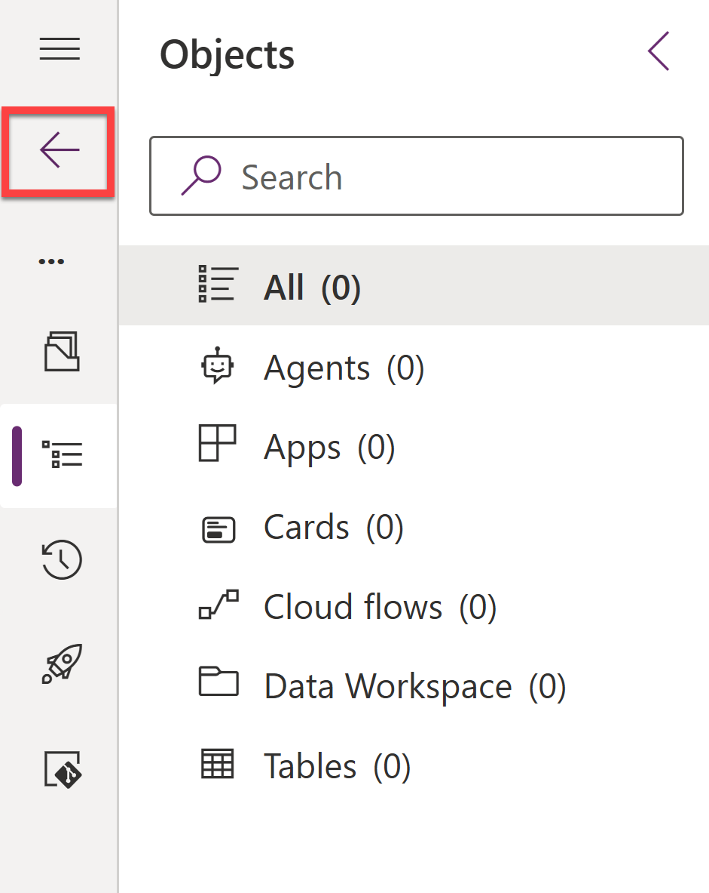

1. On the Solutions page, you should then see the **Current preferred solution** listed as `Bring Your Own Model Solution`.

    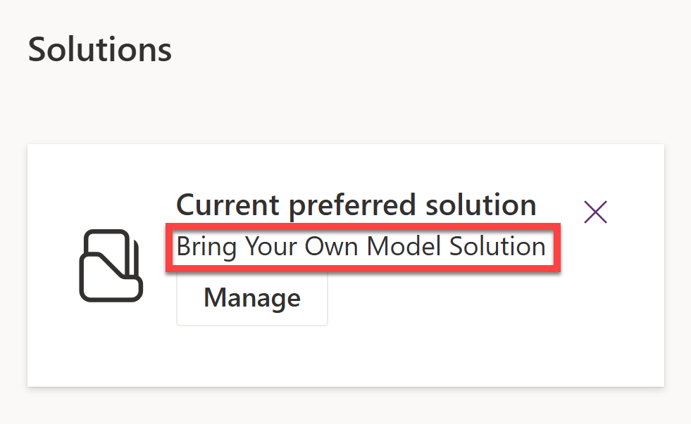

### Deploy a model from Azure AI Foundry

Now with the solution created, let's get started on bringing your own model from Azure AI Foundry.

1. Open a new tab in your browser and navigate to [Azure AI Foundry](https://ai.azure.com/). Log in with the same account you use for Power Platform and Microsoft Azure.

1. On the Azure AI Foundry home page, select **+ Create new** to create a new project.

    > **Note:**
    >
    > There are two types of projects you can create - a **hub based project** and a **Foundry project**. We will be creating a Foundry project which is built on an Azure AI Foundry resource. This project type allows for a simple setup, access to agents, and industry leading models from OpenAI, Mistral, Meta, and more. You can learn more [here](https://learn.microsoft.com/en-gb/azure/ai-foundry/what-is-azure-ai-foundry#project-types).

    Select **Azure AI Foundry resource** and then click **Next**.

    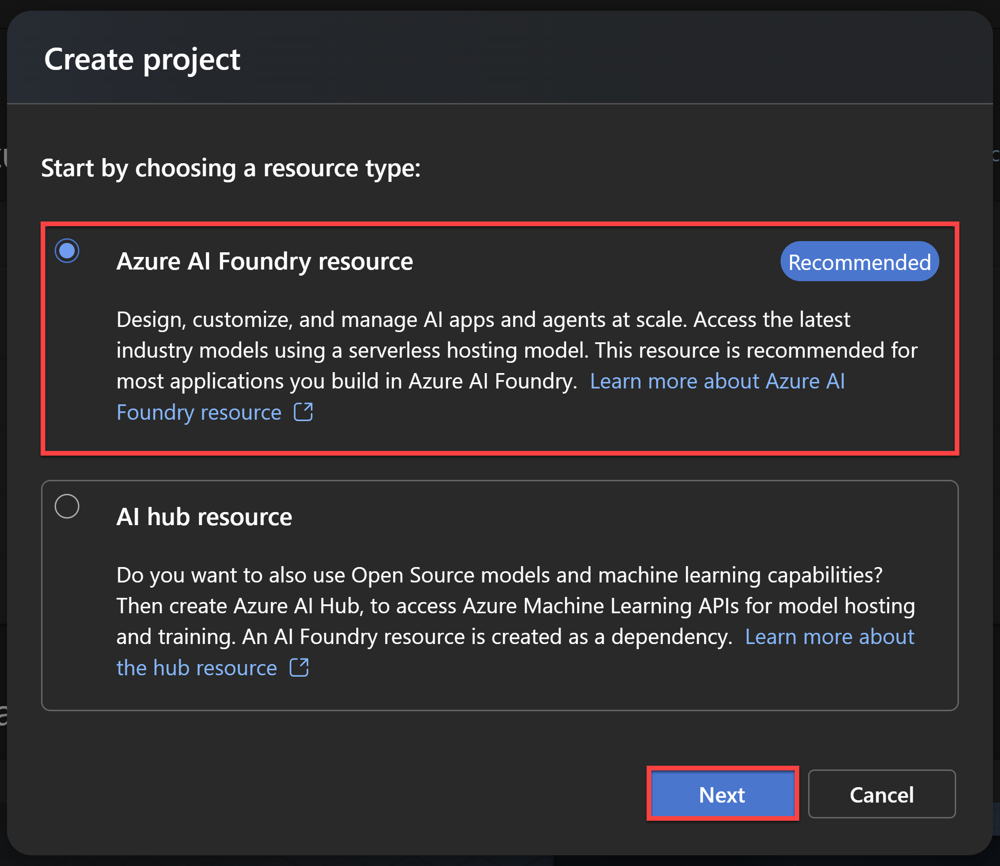

1. Give your project a name or use the default name, and then click **Create**.

    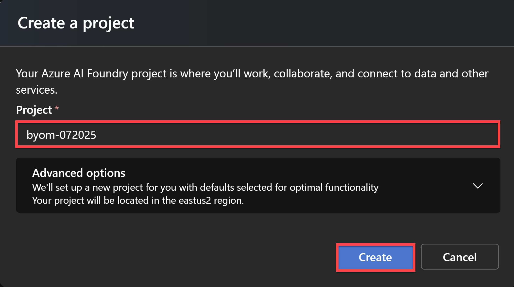

    It may take a few minutes for the project to be created.

    Once it has been created, you will be redirected to the project overview page:

    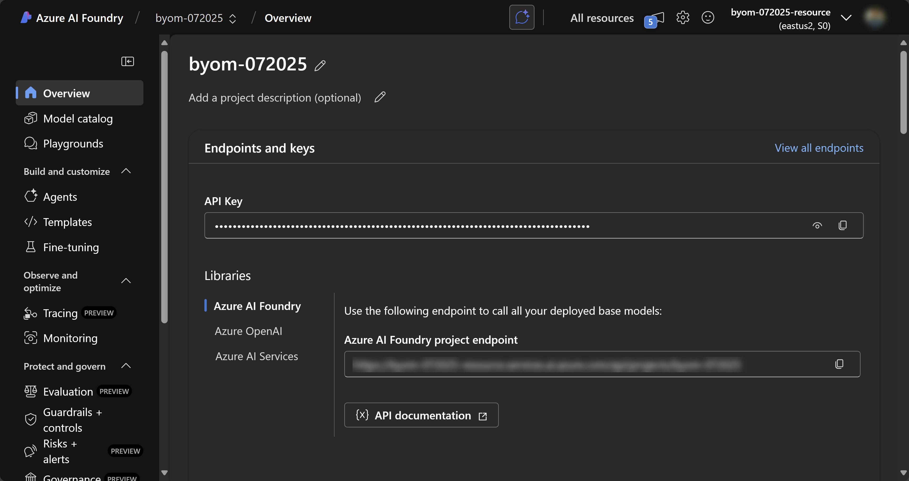

1. Now with the project created, we can deploy a model to it. On the left sidebar, select **Model catalog**. In the model catalog, you can browse through the available models.

1. Scroll down to just _below_ the **Model leaderboards** section where there are filter options.

    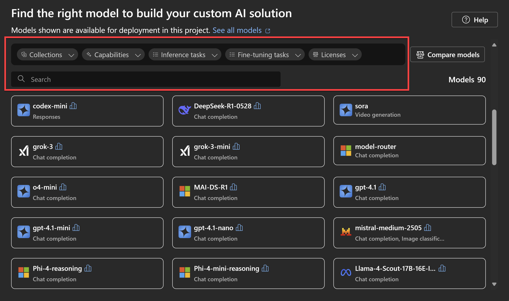

1. Here we will filter the models to only show those that are capable of **Chat completion** tasks. Select the **Inference tasks** dropdown and then select **Chat completion**.

    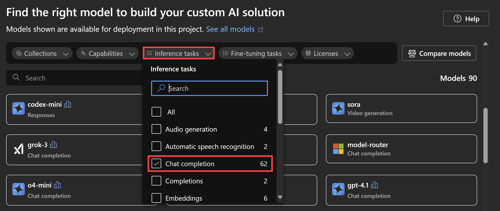

    You will now see a list of models that support chat completion tasks. For this lab, we will use the **Phi-4** model as well as the **Mistral-Nemo** model.

1. To deploy the **Phi-4** model, select it from the list and then click the **Use this model** button.

    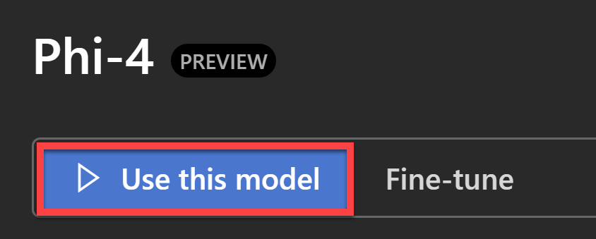

    Then select **Agree and proceed** to accept the terms of use.

1. On the **Deploy Phi-4** pane, configure the following settings:

    - **Deployment name**: `phi-4-ai-prompt`
    - **Deployment type**: `Global Standard`

    Then select **Deploy**.

    This will create a deployment of the Phi-4 model in your Azure AI Foundry project which can take a few minutes. A deployment is your specific instance of a model that you can use in your applications.

1. Once the deployment is complete, you will be redirected to the model deployment overview page. Copy the following details and save them for later use:

    - **Deployment name:** Which can be found at the top of the page
    - **Target URI:** Which can be found in the **Endpoint** section on the left-hand side of the page
    - **Key:** Which can be found in the **Endpoint** section on the left-hand side of the page

    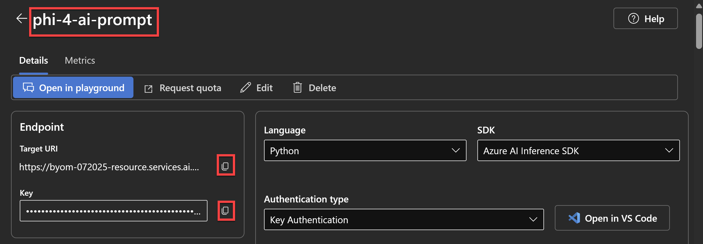

    These are the details you will need to connect the model to AI Builder.

1. Now let's deploy the **Mistral-Nemo** model. Go back to the **Model catalog** and filter the models again to show only those that support chat completion tasks.

    Select the **Mistral-Nemo** model from the list and then select **Use this model** > **Agree and proceed**.

1. On the **Deploy Mistral-Nemo** pane, configure the following settings:

    - **Deployment name**: `mistral-nemo-ai-prompt`
    - **Deployment type**: `Global Standard`

    Then select **Deploy**.

    This will create a deployment of the Mistral-Nemo model in your Azure AI Foundry project which can take a few minutes.

1. Once the deployment is complete, you will be redirected to the model deployment overview page. Copy the following details and save them for later use:

    - **Deployment name:** Which can be found at the top of the page
    - **Target URI:** Which can be found in the **Endpoint** section on the left-hand side of the page
    - **Key:** Which can be found in the **Endpoint** section on the left-hand side of the page

With both models deployed, let's go back to the Power Platform to connect them to AI Builder.

### Connect the model to AI Builder Prompts

1. On the left sidebar in the Power Apps portal, select **AI hub**.

    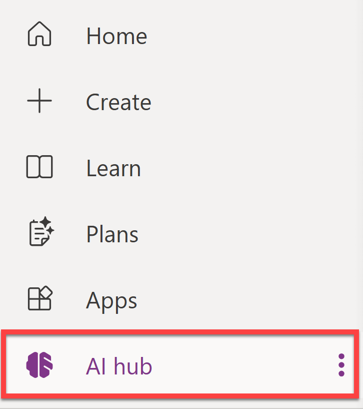

1. Select **Prompts**.

1. On the Prompts page, under the **Popular Templates** section, select the **Summarize text** template to open it.

    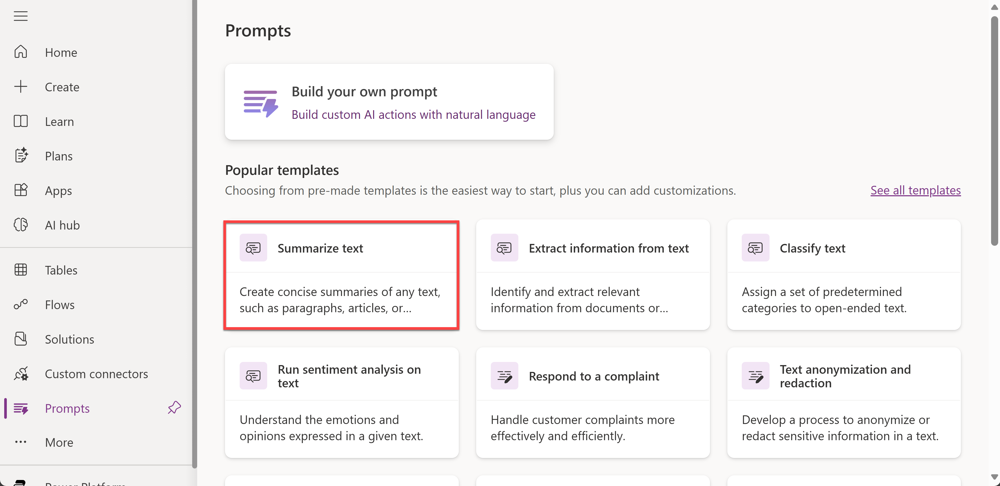

1. If you're worked with prompts before, you will know that each prompt has a model which it uses to generate responses. The default model (at the time of writing this lab) is **GPT-4.1 mini**.

    **Test** the prompt (template prompts already have sample data) to see how it responds with the default model.

    The response may be similar to the following:
    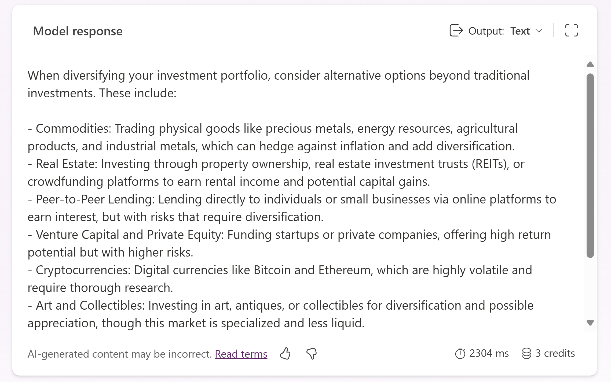

    But if you were to select the **Model** dropdown, you will see that there are other managed models to choose from.

    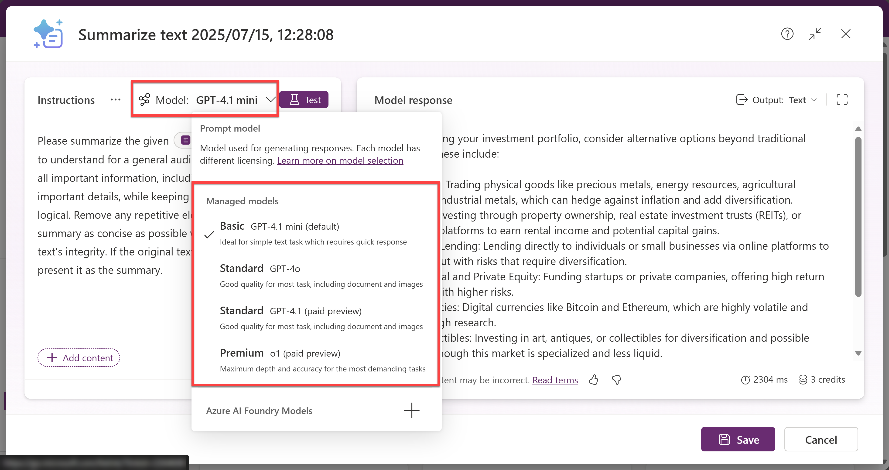

    Select the **GPT-4o** model and test it to see how it responds. Your may see a response similar to the following:

    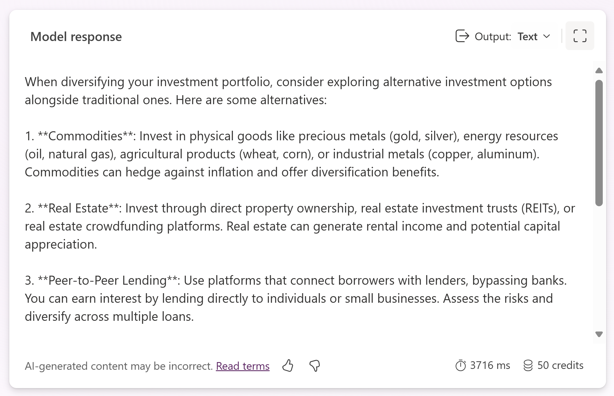

    You can see a noticeable difference in the response detail compared to the default model. This is not just a difference in text, but also in structure, format, and overall quality. This is why you may want to bring a model of your own because you may prefer the way it generates responses or you may have a specific model that is better suited for your use case.

1. So to add the models that we deployed in Azure AI Foundry, select the **Model** dropdown and then select the **+** sign next to **Azure AI Foundry Models**.

    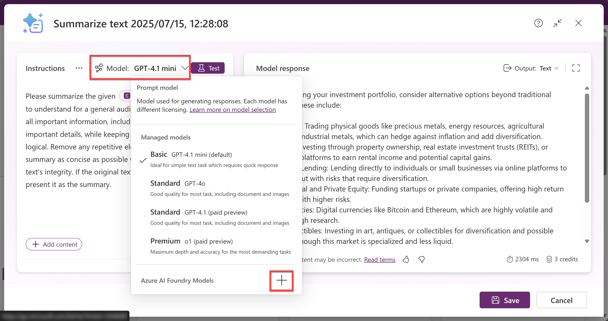

1. On the **Connect to a model from Azure AI Foundry** pane, enter the following details:

    - **Model deployment name**: `phi-4-ai-prompt` (the deployment name of the Phi-4 model that you copied earlier)
    - **Base model name**: `Phi-4` (this is the name of the model)
    - **Azure model endpoint URL**: `https://<your-endpoint>` (the target URI of the Phi-4 model deployment that you copied earlier)
    - **API Key**: `<your key here>` (the key of the Phi-4 model deployment that you copied earlier)

    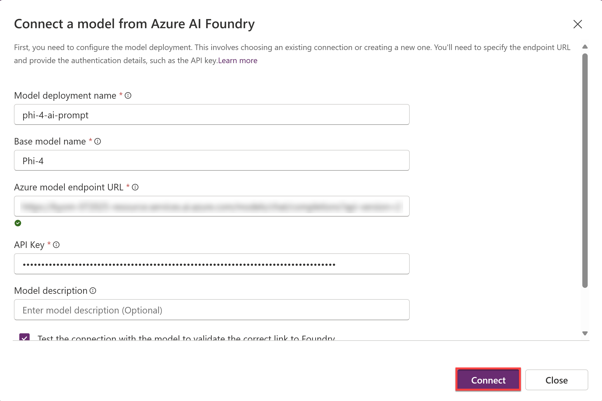

    Then select **Connect**.

1. Once the model is connected, you'll see a confirmation screen. Select **Close** to return to the prompt.

    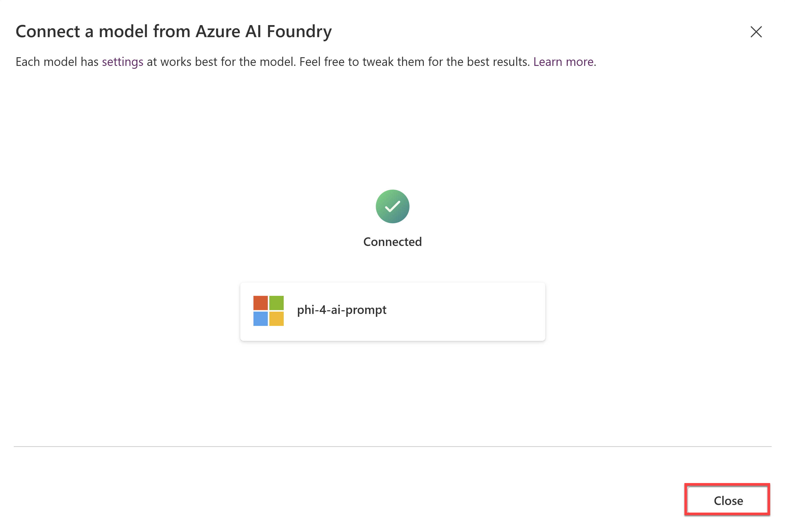

    You should also see the **phi-4-ai-prompt** model in the **Model** dropdown.

    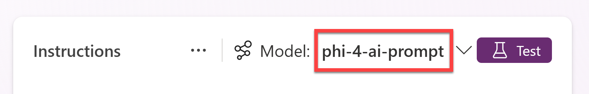

1. **Test** the prompt again with the Phi-4 model selected. You should now see a different response compared to the first two tests. 

1. Repeat the above steps to connect the **Mistral-Nemo** model. Once complete, you should have both models connected to the prompt:

    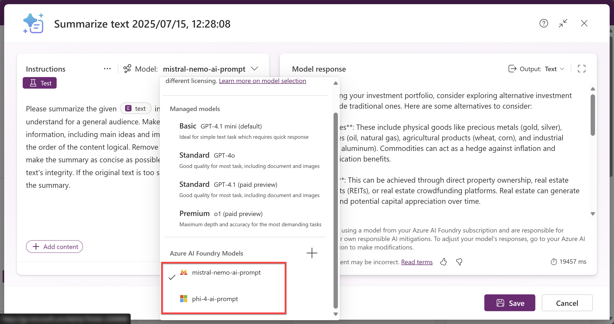

1. Save the prompt and use it across the Power Platform, including in Copilot Studio agents.

And that's it! You have successfully brought your own Azure AI Foundry models to AI Builder prompts. You can now use these models to generate responses in your applications, leveraging the power of Azure AI Foundry's advanced models.