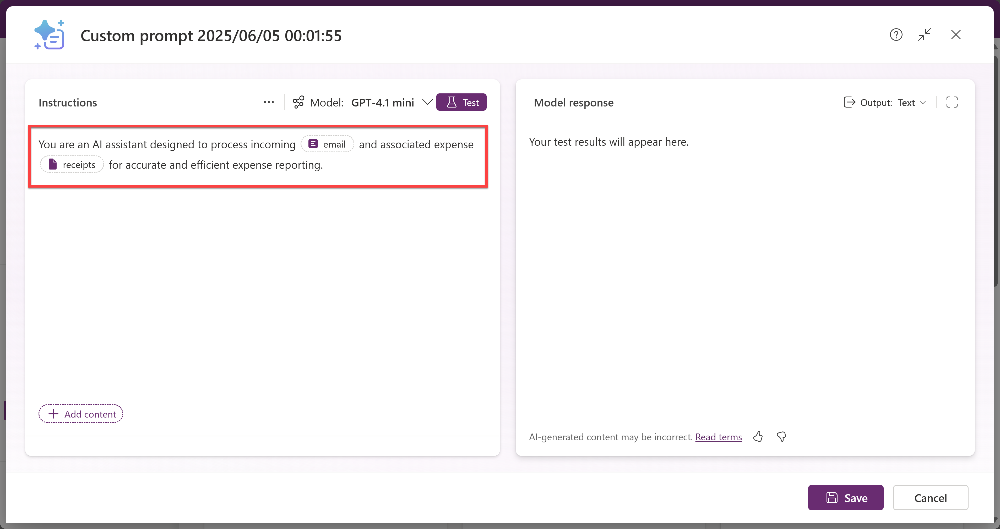
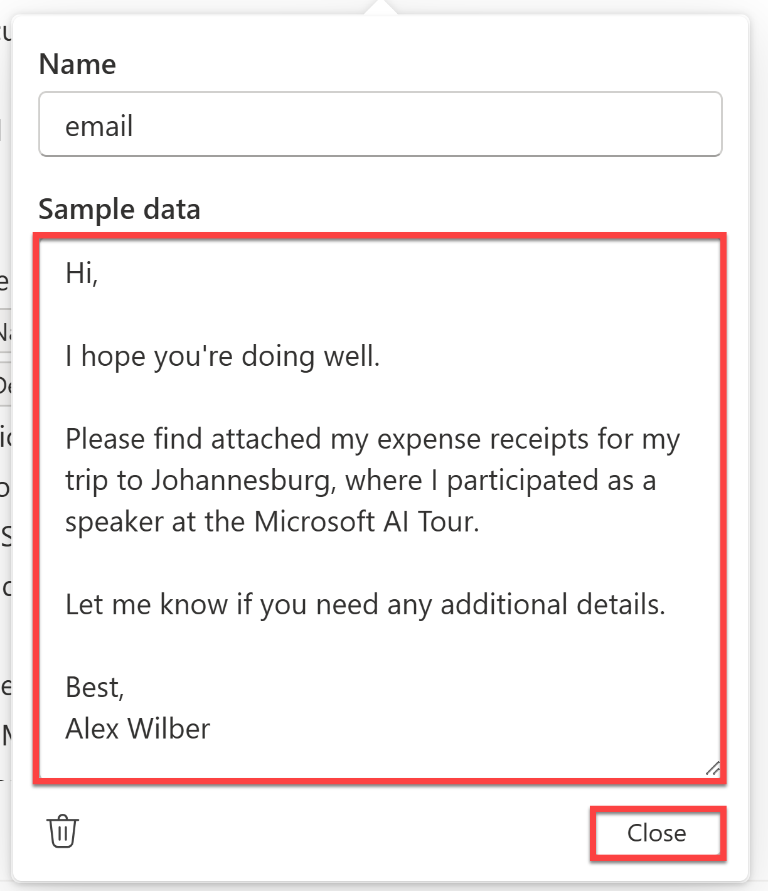
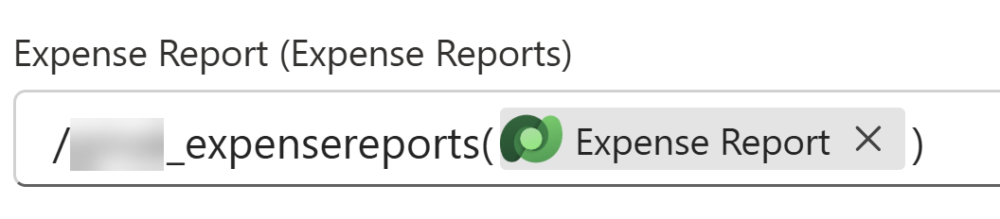
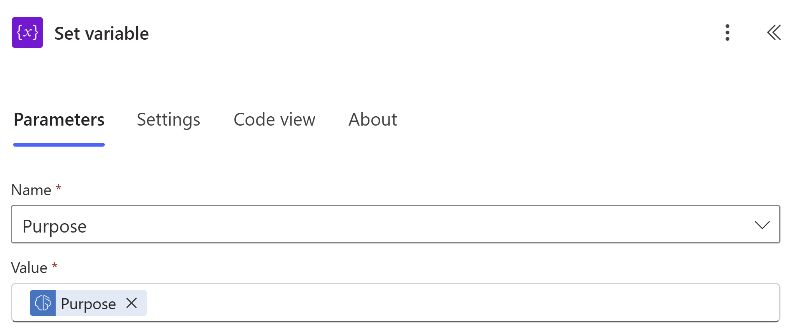

# Expense Report Processing with AI Prompts

In this lab, you will learn how to automate the processing of expense reports using AI Builder prompts and Power Automate. The lab will guide you through creating a Power Platform solution, configuring Dataverse tables, designing an AI prompt, and building a Power Automate flow to process incoming emails with expense receipts.

## ⚙️ Prerequisites

- Power Platform environment with access to:
  - AI Builder
  - Power Automate
  - Dataverse
- Microsoft Outlook linked to the same account used for Power Platform

## 🚀 Lab Walkthrough

### Create a dedicated Power Platform solution

1. Navigate to [Power Apps](https://make.powerapps.com/) and log in with your credentials.

1. On the left sidebar, select **Solutions**.

    

1. Select **+ New solution**.

    

1. On the **New solution** pane, enter the following details:
    - **Display name**: `AI Expense Report Processing`
    - **Name**: `AIExpenseReportProcessing`
    - **Publisher**: _Select a publisher or create a new one_
    - **Version**: `1.0.0.0`
    - **Set as your preferred solution**: ✅
        
        > **Note:**
        > Setting a preferred solution ensures that all your custom components go into a dedicated unmanaged solution instead of the generic system solutions, giving you clear separation, consistent publisher settings, and full control.
        >
        > This makes it easy to export your tailored solution for deployment to other Dataverse environments and keeps collaboration with others clean and predictable.
        
    

1. Then click **Create**.
  
    The solution will then be created and you will be redirected to the solution's overview page.

1. While on the solution's overview page, select the **Back to solutions** icon to return to the solutions page.

    

1. On the Solutions page, you should then see the **Current preferred solution** listed as `AI Expense Report Processing`.

    

### Create and configure Dataverse tables for Expense Reports, Expenses, and Expense Categories

1. On the left sidebar, select **Tables**.

1. Then select **Start with a blank table**.

    

1. The first table that we'll create is the **Expense Report** table. On the **Table1** table card, click on **View options** (three dots) and then select **Properties**.

    

1. Change the **Display name** of the table to `Expense Report`. The **Plural name** will automatically update to `Expense Reports`. Then click **Save**.

    

1. Now we'll add the columns. On the **Expense Report** table card, click on **View options** (three dots) and then select **View data**. (If you see the **Hide data** option instead, it means you already have the data view open.)

1. Click on the **New column** column and then select **Edit column**.

    

1. Change the **Display name** to `Expense Report ID`. Leave the **Data type** and **Format** as **Single line of text** and **Text** respectively. Expand the **Advanced options** section and change the **Schema name** to `ExpenseReportID2` so it doesn't conflict with the default `ExpenseReportID` column. Then click **Update**.

    

1. Now to add a new column, select the **+ New column** button at the top of the data view.

    

1. In the **New column** pane, enter the following details:
    - **Display name**: `Employee Name`
    - **Data type**: `Single line of text`
    - **Format**: `Text`

    Then click **Save** to create the new column.
    
    

1. Repeat the above steps to add the following columns to the **Expense Report** table:
    - **Display name**: `Employee Alias`
      - **Data type**: `Single line of text`
      - **Format**: `Text`

    - **Display name**: `Purpose`
      - **Data type**: `Single line of text`
      - **Format**: `Text`

    - **Display name**: `Total Amount`
      - **Data type**: `Currency`
  
    - **Display name**: `Submission Date`
      - **Data type**: `Date and time`
      - **Format**: `Date and time`

    - **Display name**: `Approval Status`
      - **Data type**: `Choice`
      - **Choices**: `Submitted`, `Approved`, `Rejected`, `Pending`

    - **Display name**: `Notes`
      - **Data type**: `Multiple lines of text`
      - **Format**: `Text`
      
1. Once all columns are added, your **Expense Report** table should look like this:

    

1. Now we'll create the **Expense** table. On the top navigation bar, select **+ New table** > **Add columns and data**.

    

1. On the **Table2** table card, click on **View options** (three dots) and then select **Properties**.

1. Change the **Display name** of the table to `Expense`. The **Plural name** will automatically update to `Expenses`. Then click **Save**.

1. With the **View data** panel open, click on the **New column** column and then select **Edit column**. Then change the **Display name** to `Expense Number`. Leave the **Data type** and **Format** as **Single line of text** and **Text** respectively. Then click **Update**.

1. Now add the following columns to the **Expense** table:
    - **Display name**: `Category`
      - **Data type**: `Single line of text`
      - **Format**: `Text`

    - **Display name**: `Vendor`
      - **Data type**: `Single line of text`
      - **Format**: `Text`

    - **Display name**: `Amount`
      - **Data type**: `Currency`

    - **Display name**: `Expense Date`
      - **Data type**: `Single line of text`
      - **Format**: `Text`

    - **Display name**: `Notes`
      - **Data type**: `Multiple lines of text`
      - **Format**: `Text`

1. Once all columns are added, your **Expense** table should look like this:

    

1. Now we'll create the **Expense Category** table. On the top navigation bar, select **+ New table** > **Add columns and data**.

1. On the **Table3** table card, click on **View options** (three dots) and then select **Properties**. Change the **Display name** of the table to `Expense Category`. The **Plural name** will automatically update to `Expense Categories`. Then click **Save**.

1. With the **View data** panel open, click on the **New column** column and then select **Edit column**. Then change the **Display name** to `Category Name`. Leave the **Data type** and **Format** as **Single line of text** and **Text** respectively. Then click **Update**.

1. Now add the following column to the **Expense Category** table:
    - **Display name**: `Category Description`
      - **Data type**: `Multiple lines of text`
      - **Format**: `Text`

1. Once the column is added, your **Expense Category** table should look like this:

    

1. Now that we have all 3 tables created, let's establish a table relationship. On the top navigation bar, select **Create relationships**.

    

1. In the **Create relationship** pane:
    - Select `One-to-many` as the **Relationship type**.
    - Select `Expense Report` as the **One** table.
    - Select `Expense` as the **Many** table.

    Then select **Done**.
    
    

    This will create a relationship between the **Expense Report** and **Expense** tables, allowing each expense report to have multiple expenses associated with it. In turn, each expense can only belong to one expense report.

1. With that complete, click **Save and exit** on the top right-hand corner of the screen. A confirmation dialog may appear, click **Save and exit** to confirm.

    

    This will save all the changes made to the tables and relationships.

1. Once saved, you will be redirected back to the **Tables** page. Click on the **Custom** tab to see the tables you've just created.

    

1. Before we're ready to move to AI Builder, we need to have some sample data in the **Expense Category** table. Click on the **Expense Category** table to open it.

1. Scroll down to the **Expense Category columns and data** section and then click on the **Edit** button.

    

1. Insert the following records into the **Expense Category** table by selecting **+ New row** on the top navigation bar:

    | Category Name | Category Description      |
    | -------------- | ------------- |
    | Airfare | Covers the cost of domestic and international flights for business travel. |
    | Ground Transportation | Covers local transportation costs for business-related travel, including taxis, rideshare services, shuttles, and car rentals. |
    | Hotel | Covers lodging expenses for business travel, including nightly stays at hotels, motels, or corporate housing. |
    | Meals | Covers meal expenses incurred during business travel or client meetings. |
    | Parking | Covers parking fees incurred during business-related activities, including airport parking, hotel parking, and client site visits. |
    
    

1. Once all records are added, click the back arrow on the top left-hand corner to return to the **Tables > Expense Category** page. Then go back to the **Tables** page by clicking on the **Tables** tab.

1. Now we are going to be adding an extra column to the **Expense** table to store the receipt images. At the time of writing this lab, you are unable to add an image column to a table via the previous UI. So we will do it traditionally.

    Click on the **Expense** table to open it. Then in the **Schema** section, select **Columns**.

    

    On the top navigation bar, select **+ New column** and then configure the following details:
    - **Display name**: `Receipt`
    - **Data type**: `File` > `Image`
    - **Primary Image**: ✅

    Then select **Save**. Once saved, navigate back to the **Tables** page by clicking on the **Tables** tab.

1. Finally, we need to copy the **Expense Report** table set name so that we can reference the table later in the lab. Each set name is unique as it consists of the solution publishers's prefix and the table name. To get yours, open the **Expense Report** table and then on the right-hand side, under the **Table properties** section, select **Tools** > **Copy set name**.

    

    This will copy the set name to your clipboard. You can paste it somewhere safe for later use.

With the tables created and configured, we can now move on to designing an AI prompt that will help us process expense reports.

### Design an AI prompt with AI Builder

1. On the left sidebar in the Power Apps portal, select **AI hub**.

    

1. Select **Prompts**.

1. Then select **Build your own prompt**.

    

    This will then open up the Prompt Builder:

    

    **Prompt Builder** provides the flexibility to create your own custom prompt by defining input variables that enable incorporating dynamic runtime content within a prompt. It gives you the ability to validate the prompt, ensuring optimal prompt performance and correctness of the response before integration into your business solutions.
    
    When designing a prompt, it is advised to follow the [AI Builder Prompting Guide](https://aka.ms/promptguide) to ensure that the prompt is both effective and efficient. **Prompts** are how you ask an AI model to do something for you - it largely has two parts, **instruction** and **data context**.

1. In the Prompt Builder **Instructions** section, start by writing the first part of the prompt:

    ```plaintext
    You are an AI assistant designed to process incoming email and associated expense receipts for accurate and efficient expense reporting.
    ```

1. With the task now defined, let's provide some context by adding input variables in our prompt so that we can dynamically pass in the email and receipt data when the prompt is executed.

    Start by removing the word **"email"** from the instruction and then select **Add content** > **Text** to add a text input variable.

    

    Then rename the input variable to `email` and select **Close**.

    

1. Do the same for the receipt data by removing the word **"receipts"** from the instruction and then selecting **Add content** > **Image or document** to add an image input variable. Rename the input variable to `receipts` and select **Close**.

1. The prompt instruction should now look like this with both a text input variable for the email and an image input variable for the receipts:

    

    Having image as well as text input variables shows you that AI Prompts are multi-modal, which means they can accept different types of data as input, such as text, images, and documents. This allows you to create more complex and versatile prompts that can handle a variety of tasks.

1. Now we will add expectations to the prompt instruction. These will convey to the AI model what goals you want to achieve. Add the following to the prompt instruction:

    ```plaintext
    For each email and associated receipt attachments that you receive, perform the following tasks:

    1. Categorize the expense:
    2. Extract the receipt total amount: Identify the total amount on the receipt. If it is in a foreign currency, convert to USD.
    3. Extract the vendor's name: Identify and return the cleaned name of the vendor that issued the receipt.
    4. Extract the expense date: Identify the date of the expense from the receipt, ensuring it's formatted correctly (YYYY-MM-DD).
    5. Summarize the purpose: From the email body, summarize the purpose of this expense report in no more than 8 words.
    ```

    The full prompt instruction should now look like this:

    

    Notice now 2 - 5 have clear, actionable instructions provided after the colon, guiding exactly what needs to be done while 1 is incomplete. This is because we will be using the **Expense Category** Dataverse table to provide the AI model with a list of categories to choose from. This is known as a grounded prompt.

    A grounded prompt is a specialized prompt instruction that guides an AI model by providing it with external, business-specific information, rather than relying solely on the model's pre-existing knowledge from training data.
    
    In our example, the first task ("Categorize the expense:") lacks explicit instructions because it will leverage an external source, specifically the **Expense Category** Dataverse table. By using this table, we're augmenting the model's knowledge with structured data, enabling it to select the most accurate category from predefined options.
    
    This process, known as Retrieval Augmented Generation (RAG), significantly improves the model's accuracy and reliability by grounding its responses in real-world, business-specific context.

1. So in the prompt instruction, right after "1. Categorize the expense:",
    - Type `Use the categories listed in `
    - Then select **Add content** > **Dataverse** > **Expense Category** > **Category Name** and then click **Add**

    This will add the **Expense Category** table's **Category Name** column to the prompt instruction allowing the AI model to only select categories from the list of categories defined in the **Expense Category** table.

    - Continue to type ` and use the `
    - Then select **Add content** > **Dataverse** > **Expense Category** > **Category Description** and then click **Add**
    - Then continue to type ` to help you determine the correct category based on the receipt information.`

    The addition of the **Category Description** column provides additional context to the AI model, helping it make more informed decisions when categorizing expenses.

    The prompt instruction should now look like this:

    

1. With the task, context and expectations defined, we can now move on to define the output. Here, we will specify to the model **_how_** we want to format the output of the prompt. Add the following to the prompt instruction:

    ```plaintext
    Return the extracted data in the following format:

    - Category: The correct expense category based on the receipt details.
    - Amount: The total amount in USD formatted to 2 decimal places. If the receipt is in a foreign currency, convert it to USD.
    - Vendor: The cleaned name of the vendor, removing unnecessary details.
    - Expense Date: The date of the expense in YYYY-MM-DD format.
    - Purpose: A summary of the expense report's purpose. No more than 8 words.
    - Notes: Any relevant notes about the receipt, such as the original currency and amount, missing or unclear dates, non-economy class ticket, or any potential issues with the receipt.
    ```

    The completed prompt instruction should now look like this:

    

1. Now with the prompt complete, we can test it to make sure that it works as expected. First we need to provide sample data for the input variables.

    To provide sample data for the `email` input variable, select the variable and then in the **Sample data** pane, write the following sample email:

    ```plaintext
    Hi,

    I hope you're doing well.

    Please find attached my expense receipts for my trip to Johannesburg, where I participated as a speaker at the Microsoft AI Tour.

    Let me know if you need any additional details.

    Best,
    {Your name here}
    ```

    Then select **Close**.

    

    Then for the `receipts` input variable, select the variable and then in the **Sample data** pane, upload any of the sample receipts images from the [sample-images](./sample-receipts/) folder. Or you're welcome to use your own receipts if you have any.

    Then select **Close**.

    

1. With the sample data provided, let's test the prompt. Select the **Test** button on the top right-hand corner of the **Instructions** section.

    

1. The prompt will take a couple of seconds to process the email and image input variables but once complete you should see an output similar to this: 

    

1. While this should be sufficient for our needs, we can improve the output by formatting it as a **JSON object** instead of plain text. A JSON object output also makes it easier to parse individual fields to other parts of the Power Platform and external systems. 

    To do this, select the **Text** button next to **Output** in the **Model Response** section.

    

    Then select **{} JSON** from the dropdown menu. Next, select **Customize JSON** and paste in the following JSON example:

    ```json
    {
        "Category": "Meals",
        "Amount": 7.5,
        "Vendor": "The Balalaika",
        "ExpenseDate": "2025-01-23",
        "Notes": "Original amount in ZAR: R143.00",
        "Purpose": "Speaker at Microsoft AI Tour"
    }
    ```

    Then select **Apply**.

    This will ensure that whenever the prompt is executed, the output will be formatted as a JSON object with the specified fields making it far more consistent.

1. Now select **Test** again to test the prompt with the new JSON output format. Once complete, you should see an output similar to this:

    

1. Now that the prompt is working as expected, rename the prompt to `Expense Processor` and then select **Save**.

    

With the prompt configured, tested, and saved - we can now integrate it into a Power Automate flow that will automate the processing of expense reports via email.

### Create a Power Automate flow to process expense reports

1. Navigate to [Power Automate](https://make.powerautomate.com/).

1. Ensure you are in the same environment as the Power Platform solution you created earlier.

1. On the left sidebar, select **+ Create** and then select **Automated cloud flow**.

    

1. On the **Build an automated cloud flow** pane, enter the following details:
    - **Flow name**: `Analyze Incoming Expense Reports`
    - **Trigger**: `When a new email arrives (V3)` by Office 365 Outlook

    Then select **Create**.

1. Configure the trigger by setting the following parameters:
    - **Include Attachments**: `Yes`
    - **Only with Attachments**: `Yes`
    - **Subject Filter**: `New Expense Report`
    - **Importance**: `Any`
    - **Folder**: `Inbox`

    

    This trigger will kick off the flow when a new email arrives in the inbox with the subject "New Expense Report" and contains attachments.

1. Add a new action by clicking the **New action** icon under the trigger.

    

1. In the **Add an action** pane, search for `Get user profile (V2)` and select it.

    

1. Create a connection if prompted.

1. Configure the action by setting the **User (UPN)** field to the `From` dynamic field from the **When a new email arrives (V3)** trigger. 

    To set a dynamic content field, select the empty field and then select the **Dynamic Content** icon (lightning bolt) on the right-hand side.

    

    Then select the `From` field from under the **When a new email arrives (V3)** trigger.

    

    This action will retrieve the user profile of the person who sent the email, which we will use later to populate the **Employee Name** and **Employee Alias** fields in the **Expense Report** table.

1. Next, add the **Add a new row** Dataverse action. Create a connection if prompted. Then configure the following parameters:

    - **Table name**: `Expense Reports`
    - **Expense Report ID**: `@{guid()}`

    `@{guid()}` will turn into this:

    

    This is an expression that generates a unique identifier for each expense report.

    - **Approval Status**: `Pending`
    - **Employee Alias**: `User Principal Name` dynamic content field from the **Get user profile (V2)** action
    - **Employee Name**: `Display Name` dynamic content field from the **Get user profile (V2)** action
    - **Submission Date**: `@{utcNow()}`

    The rest of your action should look like this:

    

    This action will create a new expense report in the **Expense Reports** table with the details from the email and the user profile of the person who sent the email. The approval status is set to `Pending` because not all details (the expenses) have been processed yet. The submission date will be set to the current date and time.

1. Now we will initialize two variables. One to store the expense purpose and another to store the total expense amount.

    - Add an **Initialize variable** action and configure it as follows:
        - **Name**: `Purpose`
        - **Type**: `String`
        - **Value**: `Purpose`

    - Add another **Initialize variable** action and configure it as follows:
        - **Name**: `Total Expense Amount`
        - **Type**: `Float`
        - **Value**: `0`

1. With these steps out the way, we can start processing the email attachments. Remember that a single email may contain multiple receipts, so we need to loop through each attachment and process them individually.

    Start by adding an **Apply to each** action and configure it as follows:
    - Select the **Attachments** dynamic content field from the **When a new email arrives (V3)** trigger.

    

    This ensures that the flow will process each attachment in the email one by one.

1. Now add a new action _inside_ the **Apply to each** action.

    

1. Search for the `Run a prompt` AI Builder action and select it. This is the action that will execute the AI prompt we created earlier.

    Configure the action as follows:
    - **Prompt**: `Expense Processor`
    - **Email**: `Body` dynamic content field from the **When a new email arrives (V3)** trigger
    - **Receipts**: `Attachments Content` dynamic content field from the **When a new email arrives (V3)** trigger (This field may change to `contentBytes`. It's the same thing.)

    

    This action will execute the **Expense Processor** AI prompt with the email body and the attachment content as input variables. The output will be a JSON object containing the expense details.

1. Still inside the **Apply to each** action, add the `Add a new row` Dataverse action and configure it as follows:
    - **Table name**: `Expenses`
    - **Expense Number**: `@{guid()}`
    - **Amount**: `Amount` dynamic content field from the **Run a prompt** action
    - **Category**: `Category` dynamic content field from the **Run a prompt** action
    - **Expense Date**: `Expense Date` dynamic content field from the **Run a prompt** action
    - **Notes**: `Notes` dynamic content field from the **Run a prompt** action
    - **Vendor**: `Vendor` dynamic content field from the **Run a prompt**
    - **Expense Report (Expense Reports)**: 
        - Click into the field and manually type `/`
        - Then paste in the **Expense Report** table set name you copied earlier
        - Then type `(`
        - Then select the `Expense Report` dynamic content field from the earlier **Add a new row** action
        - Then type `)`

        It should look something like this:

        

        This field establishes the relationship between the expense and the expense report it belongs to by.

    This action takes in the output from the AI prompt and creates a new expense record in the **Expenses** table with the details extracted from the email and receipt.

1. Immediately after that, add a **Upload a file or image** Dataverse action and configure it as follows:
    - **Content name**: `Expense Number` dynamic content field from the second **Add a new row** action
    - **Table name**: `Expenses`
    - **Row ID**: `Expense` dynamic content field from the second **Add a new row** action
    - **Column name**: `Receipt`
    - **Content**: `Attachments Content` dynamic content field from the **When a new email arrives (V3)** trigger

    

    This action uploads the receipt image to the **Receipt** column in the **Expenses** table. The `Expense Number` is used as the file name, and the `Attachments Content` is the content of the receipt image.

1. Next, we need to set the `Purpose` variable and increment the **Total Expense Amount** variable with data from the AI prompt output.

    - Within the **Apply to each** loop, add a **Set variable** action and configure it as follows:
        - **Name**: `Purpose`
        - **Value**: `Purpose` dynamic content field from the **Run a prompt** action

    

    - Add a **Increment variable** action and configure it as follows:
        - **Name**: `Total Expense Amount`
        - **Value**: `Amount` dynamic content field from the **Run a prompt** action

    

    These actions will set the `Purpose` variable to the purpose of the expense report and increment the `Total Expense Amount` variable with the total amount of each expense.

1. The last step of the flow is to update the **Expense Report** record with the updated details. Add a new action _outside_ the **Apply to each** loop and search for the `Update a row` Dataverse action. Configure it as follows:
    - **Table name**: `Expense Reports`
    - **Row ID**: `Expense Report` dynamic content field from the first **Add a new row** action
    - **Approval Status**: `Submitted`
    - **Purpose**: `Purpose` variable
    - **Total Amount**: `Total Expense Amount` variable

    This action will update the **Expense Report** record with the purpose of the expense report, the total amount of all expenses, and it will update the approval status to `Submitted`.

1. Finally, save the flow by selecting the **Save** button on the top right-hand corner of the screen. Once saved, select the **Test** button to test the flow.

    In the **Test flow** pane, select **Manually** and then select **Test**.

    ](./assets/test-flow.png)

1. To test the flow, open a new tab and navigate to [Outlook](https://outlook.office.com/). 
    - Create a new email with the subject `New Expense Report` and add the following body:

        ```plaintext
        Hi,

        I hope you're doing well.

        Please find attached my expense receipts for my trip to Johannesburg, where I participated as a speaker at the Microsoft AI Tour.

        Let me know if you need any additional details.

        Best,
        {Your name here}
        ```

    - In the **To** line, enter the email address associated with your Power Platform environment.
    - Attach all of the sample receipts from the [sample-receipts](./sample-receipts/) folder. Or you're welcome to use your own receipts if you have any.

    **Send** the email.

1. Once the email has been sent, return to Power Automate to see the flow run.

    You should see the flow run successfully:

    

    

1. To verify that the expense report and expenses were created successfully, navigate to [Power Apps](https://make.powerapps.com/) and on the left sidebar, select **Tables**.

    Select the **Custom** tab to see the tables you created earlier. Then select the **Expense Report** table. Scroll down to the **Expense Report columns and data** section and then click on the **Edit** button.

    You should then see the newly created expense report with the Expense Report ID, Employee Name, and Employee Alias:

    

    As well as the Purpose, Total Amount, Submission Date, Approval Status, and any Notes if provided:

    

    Now if we go back to the **Tables** page and select the **Expenses** table, we can see all the expenses that were created from the email attachments. Along with the correct Category, Vendor, Amount, and Expense Date:

    

    And the correct Receipt image uploaded, the relevant Notes, and the relationship to the same Expense Report:

    

And that's it! You've successfully created an AI-powered expense report processing solution using Power Platform. As a reminder, we;

- Created a Power Platform solution to house our Dataverse tables, AI prompt, and Power Automate flow.
- Created Dataverse tables for Expense Reports, Expenses, and Expense Categories.
- Designed an AI prompt that processes incoming emails and associated expense receipts.
- Created a Power Automate flow that automates the processing of expense reports via email, leveraging the AI prompt to extract and categorize expenses.

This is only the beginning of what you can do with AI Builder and Power Platform. You can extend this solution further by adding more features, such as:
- Integrating with Microsoft Teams to notify users when their expense report has been processed
- Adding a Power Apps canvas app to allow users to view and manage their expense reports and expenses
- Using Power BI to visualize expense reports and expenses for better insights
- Implementing additional AI Builder models to enhance the solution
- Integrating Approvals to automate the approval process for expense reports
- Adding a Copilot Studio agent to allow users to query and manage their expense reports using natural language
