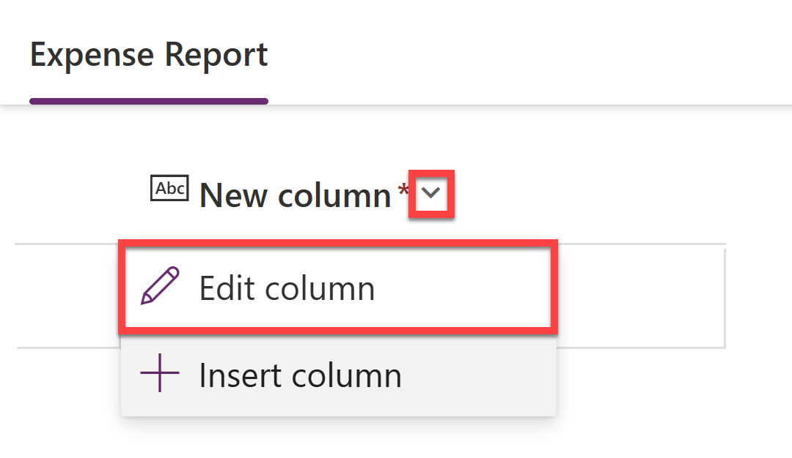

# Expense Report Processing with AI Prompts

{ description }

## ⚙️ Prerequisites

- Power Platform environment with access to:
  - AI Builder
  - Power Automate
  - Dataverse
- Microsoft Outlook linked to the same account used for Power Platform

## 🚀 Lab Walkthrough

### Create a dedicated Power Platform solution

1. Navigate to [Power Apps](https://make.powerapps.com/) and log in with your credentials.

1. On the left sidebar, select **Solutions**.
  

1. Select **+ New solution**.
  

1. On the **New solution** pane, enter the following details:
    - **Display name**: `AI Expense Report Processing`
    - **Name**: `AIExpenseReportProcessing`
    - **Publisher**: _Select a publisher or create a new one_
    - **Version**: `1.0.0.0`
    - **Set as your preferred solution**: ✅
        
        > **Note:**
        > Setting a preferred solution ensures that all your custom components go into a dedicated unmanaged solution instead of the generic system solutions, giving you clear separation, consistent publisher settings, and full control.
        >
        > This makes it easy to export your tailored solution for deployment to other Dataverse environments and keeps collaboration with others clean and predictable.

    

1. Then click **Create**.
  
    The solution will then be created and you will be redirected to the solution's overview page.

1. While on the solution's overview page, select the **Back to solutions** icon to return to the solutions page.

    

1. On the Solutions page, you should then see the **Current preferred solution** listed as `AI Expense Report Processing`.

    

### Create and configure Dataverse tables for Expense Reports, Expenses, and Expense Categories

1. On the left sidebar, select **Tables**.

1. Then select **Start with a blank table**.
   

1. The first table that we'll create is the **Expense Report** table. On the **Table1** table card, click on **View options** (three dots) and then select **Properties**.
   

1. Change the **Display name** of the table to `Expense Report`. The **Plural name** will automatically update to `Expense Reports`. Then click **Save**.
   

1. Now we'll add the columns. On the **Expense Report** table card, click on **View options** (three dots) and then select **View data**. (If you see the **Hide data** option instead, it means you already have the data view open.)

1. Click on the **New column** column and then select **Edit column**.
    

1. Change the **Display name** to `Expense Report ID`. Leave the **Data type** and **Format** as **Single line of text** and **Text** respectively. Expand the **Advanced options** section and change the **Schema name** to `ExpenseReportID2` so it doesn't conflict with the default `ExpenseReportID` column. Then click **Update**.
    

1. Now to add a new column, select the **+ New column** button at the top of the data view.
    

1. In the **New column** pane, enter the following details:
    - **Display name**: `Employee Name`
    - **Data type**: `Single line of text`
    - **Format**: `Text`

    Then click **Save** to create the new column.
    

1. Repeat the above steps to add the following columns to the **Expense Report** table:
    - **Display name**: `Employee Alias`
      - **Data type**: `Single line of text`
      - **Format**: `Text`

    - **Display name**: `Purpose`
      - **Data type**: `Single line of text`
      - **Format**: `Text`

    - **Display name**: `Total Amount`
      - **Data type**: `Currency`
  
    - **Display name**: `Submission Date`
      - **Data type**: `Date and time`
      - **Format**: `Date and time`

    - **Display name**: `Approval Status`
      - **Data type**: `Choice`
      - **Choices**: `Submitted`, `Approved`, `Rejected`, `Pending`

    - **Display name**: `Notes`
      - **Data type**: `Multiple lines of text`
      - **Format**: `Text`
      
1. Once all columns are added, your **Expense Report** table should look like this:
    

1. Now we'll create the **Expense** table. On the top navigation bar, select **+ New table** > **Add columns and data**.
   

1. On the **Table2** table card, click on **View options** (three dots) and then select **Properties**.

1. Change the **Display name** of the table to `Expense`. The **Plural name** will automatically update to `Expenses`. Then click **Save**.

1. With the **View data** panel open, click on the **New column** column and then select **Edit column**. Then change the **Display name** to `Expense Number`. Leave the **Data type** and **Format** as **Single line of text** and **Text** respectively. Then click **Update**.

1. Now add the following columns to the **Expense** table:
    - **Display name**: `Category`
      - **Data type**: `Single line of text`
      - **Format**: `Text`

    - **Display name**: `Vendor`
      - **Data type**: `Single line of text`
      - **Format**: `Text`

    - **Display name**: `Amount`
      - **Data type**: `Currency`

    - **Display name**: `Expense Date`
      - **Data type**: `Single line of text`
      - **Format**: `Text`

    - **Display name**: `Receipt`
      - **Data type**: `Single line of text` (We will change this to an **Image** later)
      - **Format**: `Text`

    - **Display name**: `Notes`
      - **Data type**: `Multiple lines of text`
      - **Format**: `Text`

1. Once all columns are added, your **Expense** table should look like this:
    

1. Now we'll create the **Expense Category** table. On the top navigation bar, select **+ New table** > **Add columns and data**.

1. On the **Table3** table card, click on **View options** (three dots) and then select **Properties**. Change the **Display name** of the table to `Expense Category`. The **Plural name** will automatically update to `Expense Categories`. Then click **Save**.

1. With the **View data** panel open, click on the **New column** column and then select **Edit column**. Then change the **Display name** to `Category Name`. Leave the **Data type** and **Format** as **Single line of text** and **Text** respectively. Then click **Update**.

1. Now add the following column to the **Expense Category** table:
    - **Display name**: `Category Description`
      - **Data type**: `Multiple lines of text`
      - **Format**: `Text`

1. Once the column is added, your **Expense Category** table should look like this:
    

1. Now that we have all 3 tables created, let's establish a table relationship. On the top navigation bar, select **Create relationships**.
   

1. In the **Create relationship** pane:
    - Select `One-to-many` as the **Relationship type**.
    - Select `Expense Report` as the **One** table.
    - Select `Expense` as the **Many** table.

    Then select **Done**.
    

    This will create a relationship between the **Expense Report** and **Expense** tables, allowing each expense report to have multiple expenses associated with it. In turn, each expense can only belong to one expense report.

1. With that complete, click **Save and exit** on the top right-hand corner of the screen. A confirmation dialog may appear, click **Save and exit** to confirm.
    

    This will save all the changes made to the tables and relationships.

1. Once saved, you will be redirected back to the **Tables** page. Click on the **Custom** tab to see the tables you've just created.
    

1. Before we're ready to move to AI Builder, we need to have some sample data in the **Expense Category** table. Click on the **Expense Category** table to open it.

1. Scroll down to the **Expense Category columns and data** section and then click on the **Edit** button.
    

1. Insert the following records into the **Expense Category** table by selecting **+ New row** on the top navigation bar:

    | Category Name | Category Description      |
    | -------------- | ------------- |
    | Airfare | Covers the cost of domestic and international flights for business travel. |
    | Ground Transportation | Covers local transportation costs for business-related travel, including taxis, rideshare services, shuttles, and car rentals. |
    | Hotel | Covers lodging expenses for business travel, including nightly stays at hotels, motels, or corporate housing. |
    | Meals | Covers meal expenses incurred during business travel or client meetings. |
    | Parking | Covers parking fees incurred during business-related activities, including airport parking, hotel parking, and client site visits. |

    

1. Once all records are added, click the back arrow on the top left-hand corner to return to the **Tables > Expense Category** page. Then go back to the **Tables** page by clicking on the **Tables** tab.

1. Finally, we need to copy the **Expense Report** table set name so that we can reference the table later in the lab. Each set name is unique as it consists of the solution publishers's prefix and the table name. To get yours, open the **Expense Report** table and then on the right-hand side, under the **Table properties** section, select **Tools** > **Copy set name**.
    

    This will copy the set name to your clipboard. You can paste it somewhere safe for later use.

With the tables created and configured, we can now move on to designing an AI prompt that will help us process expense reports.

### Design an AI prompt with AI Builder

1. On the left sidebar in the Power Apps portal, select **AI hub**.
   

1. Select **Prompts**.

1. Then select **Build your own prompt**.
   

    This will then open up the Prompt Builder:

    

    **Prompt Builder** provides the flexibility to create your own custom prompt by defining input variables that enable incorporating dynamic runtime content within a prompt. It gives you the ability to validate the prompt, ensuring optimal prompt performance and correctness of the response before integration into your business solutions.
    
    When designing a prompt, it is advised to follow the [AI Builder Prompting Guide](https://aka.ms/promptguide) to ensure that the prompt is both effective and efficient. **Prompts** are how you ask an AI model to do something for you - it largely has two parts, **instruction** and **data context**.

1. In the Prompt Builder **Instructions** section, start by writing the first part of the prompt:

    ```plaintext
    You are an AI assistant designed to process incoming email and associated expense receipts for accurate and efficient expense reporting.
    ```

1. With the task now defined, let's provide some context by adding input variables in our prompt so that we can dynamically pass in the email and receipt data when the prompt is executed.

    Start by removing the word **"email"** from the instruction and then select **Add content** > **Text** to add a text input variable.

    

    Then rename the input variable to `email` and select **Close**.

    

1. Do the same for the receipt data by removing the word **"receipts"** from the instruction and then selecting **Add content** > **Image or document** to add an image input variable. Rename the input variable to `receipts` and select **Close**.

1. The prompt instruction should now look like this with both a text input variable for the email and an image input variable for the receipts:

    

    Having image as well as text input variables shows you that AI Prompts are multi-modal, which means they can accept different types of data as input, such as text, images, and documents. This allows you to create more complex and versatile prompts that can handle a variety of tasks.

1. Now we will add expectations to the prompt instruction. These will convey to the AI model what goals you want to achieve. Add the following to the prompt instruction:

    ```plaintext
    For each email and associated receipt attachments that you receive, perform the following tasks:

    1. Categorize the expense:
    2. Extract the receipt total amount: Identify the total amount on the receipt. If it is in a foreign currency, convert to USD.
    3. Extract the vendor's name: Identify and return the cleaned name of the vendor that issued the receipt.
    4. Extract the expense date: Identify the date of the expense from the receipt, ensuring it's formatted correctly (YYYY-MM-DD).
    5. Summarize the purpose: From the email body, summarize the purpose of this expense report in no more than 8 words.
    ```

    


